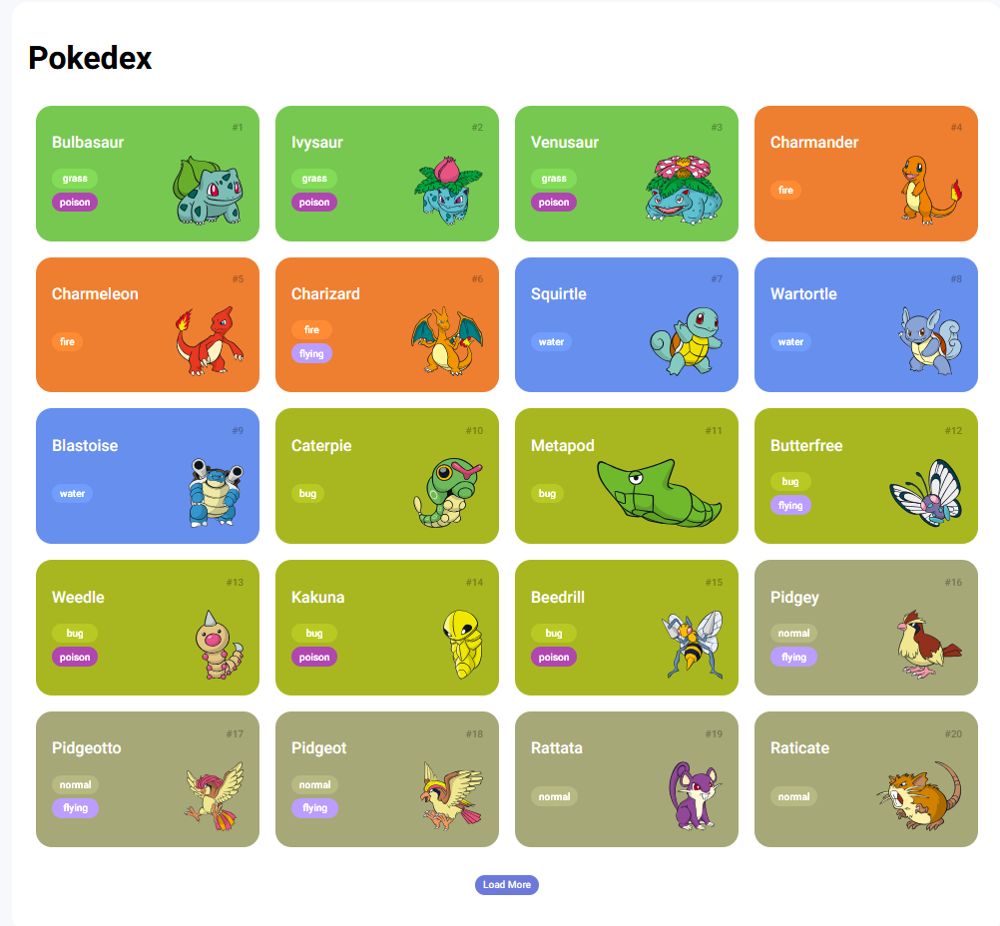

# Pokémon Listing

This is a simple Pokémon listing app created using JavaScript, CSS, and HTML. The app displays a list of Pokémon with their images, names, and types. Users can browse through a selection of Pokémon fetched from an API or stored locally.

## Features

- Display a list of Pokémon with images and types.
- Search functionality to filter Pokémon by name.
- Responsive design for different screen sizes.
- Fetch Pokémon data from the [PokéAPI](https://pokeapi.co/) or use a local JSON file.


## Screenshots



## Technologies Used

- **HTML**: To structure the webpage.
- **CSS**: For styling and making the app responsive.
- **JavaScript**: To handle data fetching, filtering, and dynamic content generation.

## Getting Started

To get a local copy of the project and run it on your machine, follow these steps:

### Prerequisites

- A modern web browser (Chrome, Firefox, Safari, etc.)

### Installation

1. Clone the repository:
```
    git clone https://github.com/Kiamisa/js-developer-pokedex-dio
```
2. Navigate to the project directory:
```
    cd pokemon-listing
```
3. Open `index.html` in your browser:
```
    open index.html
```

## Usage

- The Pokémon list is displayed on the homepage.
- Use the search bar to filter Pokémon by name.
- Click on a Pokémon card to see additional information (optional feature).

## Project Structure

```
├── index.html        # Main HTML file
├── style.css         # Stylesheet for the project
├── app.js            # Main JavaScript file for fetching and displaying Pokémon
└── README.md         # Project documentation
```

## API Reference

This project uses the [PokéAPI](https://pokeapi.co/docs/v2) to fetch data about Pokémon. Here's an example of how you can fetch a list of Pokémon:

```javascript
fetch('https://pokeapi.co/api/v2/pokemon?limit=151')
  .then(response => response.json())
  .then(data => {
    // Process the Pokémon data
  })
  .catch(error => console.error('Error fetching Pokémon:', error));
```

## Contributing

Contributions are welcome! If you'd like to contribute, please fork the repository and submit a pull request.

1. Fork the Project
2. Create your Feature Branch (`git checkout -b feature/AmazingFeature`)
3. Commit your Changes (`git commit -m 'Add some AmazingFeature'`)
4. Push to the Branch (`git push origin feature/AmazingFeature`)
5. Open a Pull Request
